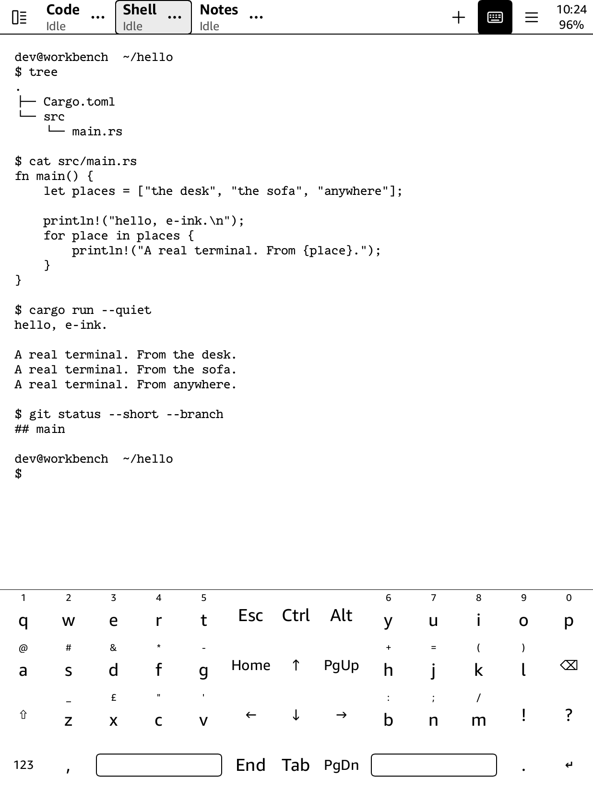
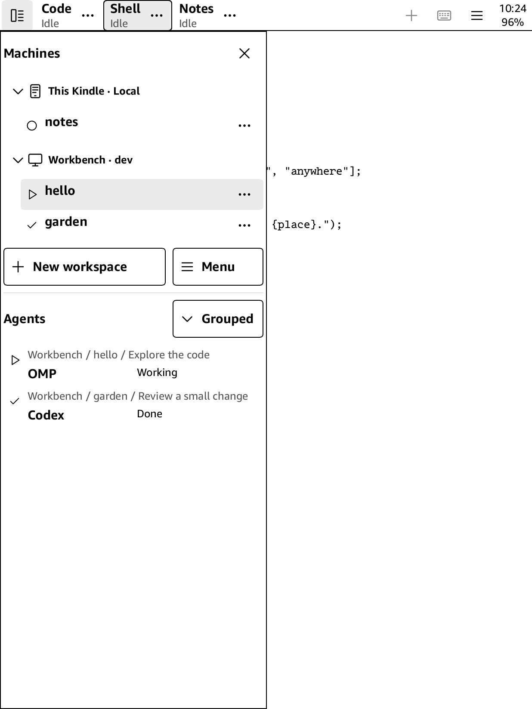

# kherdr

A touch-first terminal for jailbroken Kindles. Run a local shell, connect over SSH, or use your [Herdr](https://herdr.dev/) workspaces and coding agents on an e-ink screen.

- Type with a split touch keyboard, including symbols, function keys, and modifiers.
- Switch between local and remote workspaces, tabs, and split panes.
- Leave Herdr sessions running when you close the Kindle app.

<p>
  
  
</p>

*Kindle framebuffer captures with demo content. These do not show physical e-ink refresh behavior.*

## Requirements and availability

You need an already-jailbroken Kindle with [KPM](https://kindlemodding.org/kindle-dev/kpm/). The package includes the local Herdr server.

For remote terminals, you need Wi-Fi access to an SSH server and an account on that machine. To view remote Herdr sessions, the host also needs [Herdr 0.9.0](https://github.com/herdrdev/herdr/releases) and Python 3 on a Unix-like system. Ordinary SSH terminals do not need remote Herdr.

## Install

Download the `.kpkg` from [Releases](https://github.com/theblazehen/kherdr/releases). For development builds, open a successful [CI run](https://github.com/theblazehen/kherdr/actions/workflows/release.yml), download its **kherdr-kindle** artifact, and extract the `.kpkg` from the ZIP.

1. Back up existing kherdr settings and quit the app.
2. Copy the `.kpkg` to the root of the Kindle's USB drive. Keep it as an archive.
3. Safely eject the Kindle. Enter this in the Kindle search bar:

   ```text
   ;kpm install file:///mnt/us/kherdr-0.1.0.kpkg
   ```

4. Open **Kherdr Terminal** in the library, or enter:

   ```text
   ;kpm launch kherdr
   ```

The library entry lists `theblazehen` as its author. If it does not appear, use the search-bar launch command and see [Troubleshooting](#troubleshooting).

### Update or uninstall

Quit the app before updating. For a local-file update with KPM 0.2.2, uninstall the current package, then install the new file:

```text
;kpm uninstall kherdr
;kpm install file:///mnt/us/kherdr-0.1.0.kpkg
```

Uninstall keeps your settings, credentials, and Herdr sessions. Reinstall uses the same data. Existing sessions keep using their retained server binary until you restart them.

### Migrate a manual installation

On first launch, kherdr imports `/mnt/us/extensions/kherdr-dev/etc/` if `/mnt/us/kherdr/etc/` does not exist. It keeps the original directory and preserves existing local sessions.

Use the KPM launcher after migration. Keep the old directory until shells and SSH helpers that depend on it have exited.

## Open a terminal

Choose **Local terminal** for a shell on the Kindle.

To connect to another machine:

1. Choose **Connect via SSH**. Enter the host and username, then choose **Password** or **SSH key**. Advanced settings include the port.
2. Compare the SSH fingerprint with a trusted source before accepting it. Sign in when prompted.
3. Select a running Herdr session and choose **Open**. To start a session, choose **New session**. For an ordinary SSH terminal, choose **Open SSH terminal** from the host's ellipsis menu.

Unchecking a session hides it on the Kindle without ending the remote work. Herdr sessions survive a Kindle disconnect. An ordinary SSH terminal can lose its remote commands if the SSH connection drops.

Attaching resizes the terminal to fit the Kindle. Another attached client can take the size back when it sends input.

## Controls

- Open **Machines** at the top left to choose a session and workspace.
- Tabs belong to the active workspace. The tab strip appears when it has multiple tabs. Swipe horizontally to reach tabs that do not fit.
- Tap a pane to focus it. Open **Menu**, then **Pane actions**, for its controls.
- Tap **Keyboard** to show or hide the touch keyboard. **123** opens symbols. **Fn** opens function keys.
- Swipe vertically to scroll. PgUp and PgDn send key presses to the terminal application.
- Hold terminal text, then drag to select it. Copy and Paste appear with the selection.
- Tap the clock and battery area to open Kindle Quick Settings.

**Quit kherdr** closes the interface and leaves Herdr sessions running. Closing a pane can end the shell or process inside it.

## Data and credentials

kherdr stores data in `/mnt/us/kherdr/`, outside the package directory.

- `etc/` contains connections, settings, SSH keys, passwords, trusted host keys, and local Herdr configuration.
- `var/launcher.log` records startup and client diagnostics.
- `etc/local-herdr/server.log` records local server diagnostics.
- `runtime/<binary-pair-hash>/` holds retained client and server executables. Each pair uses about 40 MB beyond the installed package. Keep pairs that running sessions still use.

**Remembered passwords are stored as plaintext.** Keep backups private. Do not attach the settings directory to a bug report.

## Troubleshooting

If the app returns to the library immediately, check `var/launcher.log`. For local server failures, check `etc/local-herdr/server.log`. A migrated server may still write to the old installation's log until it exits.

If the library entry is missing, return to the Kindle home screen. The library scanner may be unavailable while KOReader is active. Use `;kpm launch kherdr` to launch without the library entry.

If remote sessions do not appear, check SSH authentication, `python3`, and `herdr --version` in that account. The expected version is `herdr 0.9.0`. Its executable must be on PATH, at `~/.local/bin/herdr`, or configured explicitly.

For an SSH host-key mismatch, verify the new fingerprint through a trusted channel before replacing the saved key.

When reporting a problem, include the Kindle model, firmware, kherdr build, failed action, and relevant log excerpt. Remove credentials and private terminal content. Use a photo or video for e-ink refresh problems.

## Contributing

Bug reports, device compatibility results, and patches are welcome. Include your Kindle model, firmware version, and steps to reproduce the problem.


## Author and license

kherdr is maintained by [theblazehen](https://github.com/theblazehen) and licensed under [GPL-3.0-or-later](COPYING). Herdr, Slint, libghostty-vt, and other dependencies retain their own licenses. Packages include their license and notice files. Kindle system fonts load from the device and are not redistributed.
